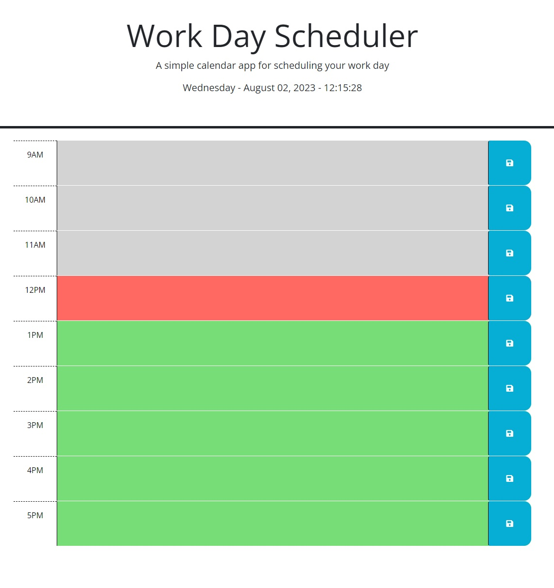

# schedule-planner

[This Schedule Planner](https://elrond-hubbard.github.io/schedule-planner/) allows the  
user to save important reminders in time blocks on the page. Each time block is  
color-coded based on the time of day. The application uses Day.js to generate an  
accurate clock for the user.

## How to Use  
To add reminders, click on any time block and use your keyboard to input text.  
To save a reminder, click the save icon to the right of the time block.  
